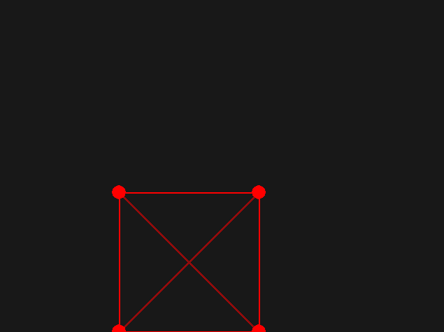
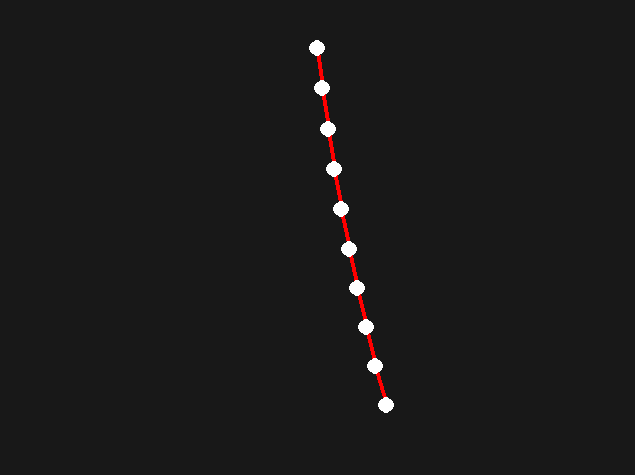
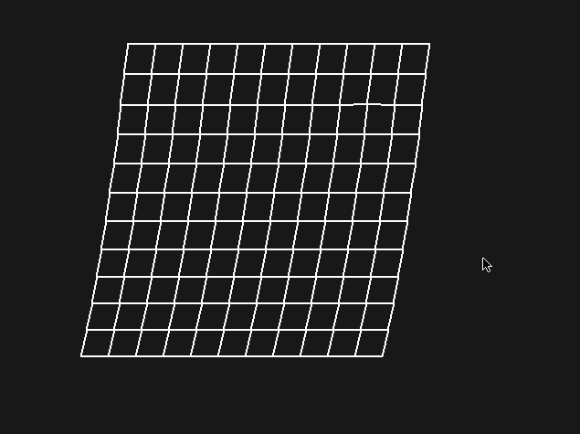

# Soft-Body Physics Simulation

A 2D physics simulation to implement the motion and properties of deformable objects (soft bodies).

## About

Motion of individual point masses are simulated through space using an integration method known as *verlet integration*. These point masses are then constrained together with the use of *spring constraints*, which are modelled after Hooke's Law.

By positioning these point masses and connecting them in specific, structurally-integral ways, we can model more complex objects that are both deformable yet are stable in maintaining their original shape.

## Requirements

This project was written in Python 2.7 and Pygame 1.9.1. Newer versions of both are available, but have not been tested against this codebase for compatibility.

## Usage

The 'App.py' source file is merely an abstraction of the Pygame overhead, so that we can include
it into our simulations and quickly/easily set up rendering and input functions with minimal
boilerplate code.

The following source code files are used as a library API:
- World.py
- Particle.py
- Constraint.py
- Composite.py
- Material.py
- Vector.py

> All functionality of the simulation can be included easily by using:

> `from VerletPhysics import *`

> Which will include all of the above source files for use.

Sample demonstrations of the physics simulation can be found by running any Python source file
that begins with the prefix 'Demo'.

## External Links

[Soft-Body Dynamics](https://en.wikipedia.org/wiki/Soft-body_dynamics)

[Verlet Integration](https://en.wikipedia.org/wiki/Verlet_integration)

[Hooke's Law](https://en.wikipedia.org/wiki/Hooke's_law)
